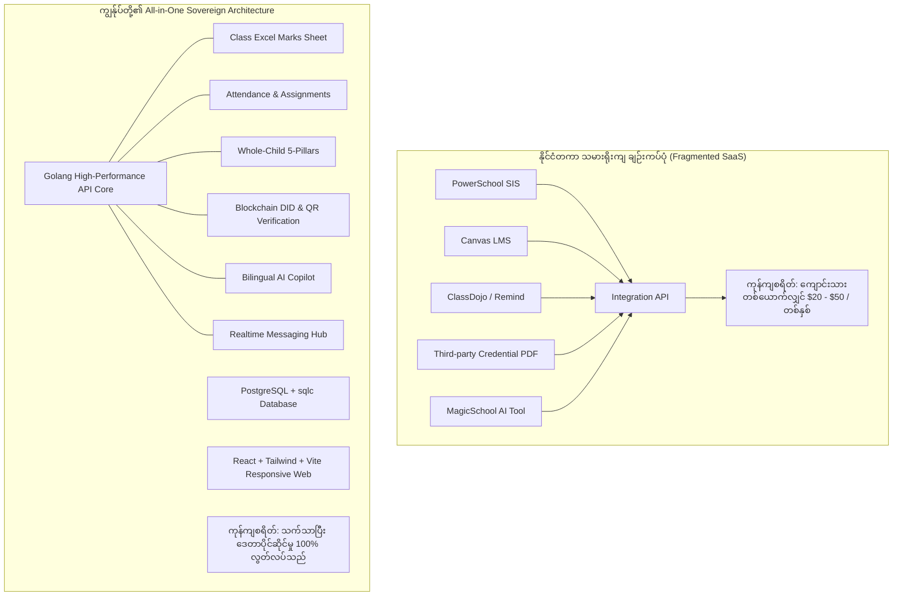

# နိုင်ငံတကာ အဆင့်မြင့် ပညာရေးစနစ်များနှင့် နှိုင်းယှဉ်လေ့လာချက် အစီရင်ခံစာ
## Comprehensive Comparison: Myanmar AI Education Platform vs. Global First-World K-12 EdTech Systems

---

## ၁။ အကျဉ်းချုပ် ခြုံငုံသုံးသပ်ချက် (Executive Summary)

ဖွံ့ဖြိုးပြီး ပထမကမ္ဘာနိုင်ငံများ (အမေရိကန်၊ ယူကေ၊ စင်ကာပူ၊ ဖင်လန်၊ သြစတြေးလျ၊ ကနေဒါ) ရှိ **အစိုးရကျောင်းများနှင့် နိုင်ငံတကာကျောင်း (International Schools)** များတွင် ယခု ကျွန်ုပ်တို့ တည်ဆောက်ထားသော စနစ်ကဲ့သို့ **ကျောင်းသားအချက်အလက် စီမံခန့်ခွဲမှု (SIS)**၊ **သင်ကြားရေးစနစ် (LMS)**၊ **အမှတ်စာရင်းဇယား (Spreadsheet Gradebook)** နှင့် **ဘက်စုံဖွံ့ဖြိုးမှု မှတ်တမ်း (Whole-Child Profile)** များကို မဖြစ်မနေ အသုံးပြုကြပါသည်။

သို့သော် နိုင်ငံတကာတွင် ဤလုပ်ငန်းစဉ်များကို ဆောင်ရွက်ရန် ကုမ္ပဏီကြီး ၃-၄ ခုထံမှ သီးခြား Software များကို ခွဲခြားဝယ်ယူ (Fragmented SaaS) အသုံးပြုရလေ့ရှိပြီး ကုန်ကျစရိတ် အလွန်ကြီးမားပါသည်။ ယခု ကျွန်ုပ်တို့ တည်ဆောက်ထားသော ပလက်ဖောင်းသည် ထိုခေတ်မီ အင်္ဂါရပ်အားလုံးကို **All-in-One Sovereign Architecture** အဖြစ် ပေါင်းစပ်ထားရုံသာမက နိုင်ငံတကာ ကျောင်းအများစုပင် မသုံးနိုင်သေးသည့် **W3C Blockchain Verifiable Credential & DID Verification** စနစ်ကိုပါ အဆင့်ကျော်လွှား ထည့်သွင်းတည်ဆောက်ထားခြင်း ဖြစ်ပါသည်။

---

## ၂။ နိုင်ငံတကာတွင် လက်ရှိ အသုံးများသော စနစ်ကြီးများ (Global Benchmark Ecosystem)

| စနစ်အမျိုးအစား | နိုင်ငံတကာတွင် အသုံးများသော ထိပ်တန်း Software များ | အသုံးပြုသည့် ဒေသ | အဓိက လုပ်ဆောင်ချက် |
| :--- | :--- | :--- | :--- |
| **SIS (Student Information System)** | **PowerSchool**, **Infinite Campus**, **Arbor**, **SIMS** | US, UK, Global International Schools | ကျောင်းသား/ဆရာ စာရင်း၊ ကျောင်းခေါ်ချိန်၊ အတန်းခွဲ၊ စာမေးပွဲ အမှတ်စာရင်း |
| **LMS (Learning Management System)** | **Canvas by Instructure**, **Google Classroom**, **Schoology** | Global, US, UK, Australia | သင်ခန်းစာများ၊ အိမ်စာ/Assignment ပေးပို့စစ်ဆေးခြင်း၊ Online Grading |
| **IB & Holistic Portfolio** | **Toddle**, **ManageBac** | IB World Schools (ဥပမာ- စင်ကာပူ၊ ဆွစ်ဇာလန်) | ဘက်စုံဖွံ့ဖြိုးမှု၊ SEL (စိတ်ပိုင်းဆိုင်ရာ)၊ CAS (လူမှုအကျိုးပြု လုပ်ငန်းများ) |
| **Parent-Teacher Communication** | **ClassDojo**, **Remind**, **ParentSquare** | US, UK, Canada | မိဘ-ဆရာ တိုက်ရိုက် မက်ဆေ့ခ်ျ၊ ကျောင်းတွင်း ကြေညာချက်၊ အသိပေးချက်များ |
| **AI Lesson Planning** | **MagicSchool.ai**, **Khanmigo (Khan Academy)** | US, Pioneering Schools | AI ဖြင့် သင်ရိုးညွှန်းတမ်း ရေးဆွဲခြင်း၊ စာမေးပွဲ မေးခွန်းထုတ်ခြင်း |
| **Digital Credentials** | **Singapore OpenCerts**, **Parchment**, **Blockcerts (MIT)** | Singapore, US Universities | ဘွဲ့လက်မှတ်နှင့် အောင်လက်မှတ်များကို ဒစ်ဂျစ်တယ်စနစ်ဖြင့် စိစစ်ခြင်း |

---

## ၃။ အင်္ဂါရပ်တစ်ခုချင်းအလိုက် အသေးစိတ် နှိုင်းယှဉ်ချက် (Feature-by-Feature Comparison Matrix)

### (က) စာမေးပွဲ အမှတ်စာရင်းဇယား (Excel / Spreadsheet Gradebook)

| အချက်အလက် | နိုင်ငံတကာ စနစ်များ (PowerSchool / Canvas) | ကျွန်ုပ်တို့၏ ပလက်ဖောင်း (Class Exam Marks) | သုံးသပ်ချက် |
| :--- | :--- | :--- | :--- |
| **အသုံးပြုရသည့် ပုံစံ** | Google Sheet / Excel ကဲ့သို့ Grid Layout ဖြင့် ဆရာများ အမှတ်ရိုက်ထည့်ခြင်း | HTML5 Monospace Spreadsheet Grid ဖြင့် တည်ဆောက်ထားခြင်း | တူညီသော အဆင့်မြင့် အတွေ့အကြုံ ရရှိသည် |
| **Keyboard Navigation** | `Enter`, `Tab`, `Arrow Keys (↑, ↓, ←, →)` ဖြင့် cell များ အမြန်ကူးပြောင်းနိုင်ခြင်း | `Enter`/`↓` ဖြင့် အောက်ဆင်း၊ `Tab`/`→` ဖြင့် ဘေးရွေ့၊ `Ctrl+S` ဖြင့် သိမ်းဆည်းခြင်း | Excel အတိုင်း လွတ်လပ်ပေါ့ပါးစွာ ဖြည့်သွင်းနိုင်သည် |
| **ဘာသာရပ် စနစ်** | အနောက်တိုင်း ဘာသာရပ်ခွဲများ (Math, ELA, Science, Social Studies) | မြန်မာ့ပညာရေး စံသတ်မှတ်ချက် (မြန်မာ၊ အင်္ဂလိပ်၊ သင်္ချာ၊ ရူပ၊ ဓာတု၊ ဇီဝ၊ ပထဝီ၊ သမိုင်း၊ ဘောဂ၊ လူမှုရေး) | နိုင်ငံတော် ပညာရေး စံနှုန်းနှင့် အတိအကျ ကိုက်ညီသည် |
| **Live Calculations** | Total, Average, Letter Grades (A, B, C, F) အလိုအလျောက် တွက်ချက်ပြသခြင်း | စုစုပေါင်း (Total)၊ ပျမ်းမျှ (Average) နှင့် ဂုဏ်ထူး/အောင်/ရှုံး status တိုက်ရိုက် တွက်ချက်ခြင်း | အမှတ်ရိုက်သည်နှင့် Real-time ချက်ချင်း တွက်ချက်ပေးသည် |
| **Data Export** | CSV / Excel (.xlsx) သို့ Export ထုတ်ယူခြင်း | တစ်ချက်နှိပ်ရုံဖြင့် UTF-8 CSV (Excel Compatible) သို့ Export ထုတ်ယူနိုင်ခြင်း | ဒေတာ လွတ်လပ်စွာ သိမ်းဆည်းနိုင်သည် |

---

### (ခ) ဘက်စုံဖွံ့ဖြိုးမှု ပရိုဖိုင် (Whole-Child Development Profile)

* **နိုင်ငံတကာ (Toddle / ManageBac / Scandinavian Models):**
  * စာမေးပွဲ အမှတ်တစ်ခုတည်းကိုသာ ဦးစားမပေးဘဲ ကလေးငယ်၏ **SEL (Social-Emotional Learning)**၊ စာရိတ္တ၊ ကိုယ်ကာယကျန်းမာရေးနှင့် အသင်းအဖွဲ့ ပူးပေါင်းဆောင်ရွက်နိုင်စွမ်းတို့ကို ရေရှည် Portfolio အဖြစ် သိမ်းဆည်းကြပါသည်။
* **ကျွန်ုပ်တို့၏ ပလက်ဖောင်း:**
  * **မဏ္ဍိုင် (၅) ရပ် Whole-Child Matrix** ပါဝင်သည်-
    1. **Academic Profile:** ဘာသာရပ်အလိုက် အရည်အချင်းစံနှုန်း ကျွမ်းကျင်မှု (Competency Mastery)
    2. **Physical Growth:** အရပ်၊ ကိုယ်အလေးချိန်၊ BMI Index နှင့် အားကစား/ကာယ ပါဝင်မှု
    3. **Health Visibility:** အမြင်၊ အကြား၊ သွားနှင့်ခံတွင်း၊ တစ်နိုင်ငံလုံး သန်ချဆေး/ဗီတာမင်အေ တိုက်ကျွေးမှု
    4. **Wellbeing Profile:** စိတ်ခံစားမှု၊ စာသင်ခန်းတွင်း အာရုံစူးစိုက်မှုနှင့် နှစ်သိမ့်ဆွေးနွေးမှု မှတ်တမ်း
    5. **Social Citizenship:** ခေါင်းဆောင်မှု၊ စာကြည့်တိုက်/ကလပ်အသင်းများနှင့် နိုင်ငံသားကောင်း တာဝန်သိမှုဆုတံဆိပ်များ

---

### (ဂ) ဒစ်ဂျစ်တယ် ကျောင်းသားသက်သေခံကတ်နှင့် အောင်လက်မှတ် စိစစ်ခြင်း (Digital ID & Verifiable Credentials)

* **နိုင်ငံတကာ အခြေအနေ:**
  * အမေရိကန်နှင့် ယူကေရှိ ကျောင်းအများစုသည် ယနေ့တိုင် ဗဟို Database သို့မဟုတ် စာရွက်စာတမ်း/PDF ဖြင့်သာ ထုတ်ပေးနေဆဲ ဖြစ်ပါသည်။ စင်ကာပူနိုင်ငံ၏ **OpenCerts** နှင့် MIT တက္ကသိုလ်၏ **Blockcerts** စသည့် ရှေ့ပြေးအဖွဲ့အစည်းများသာ Blockchain နည်းပညာကို စတင်သုံးစွဲနေပါသည်။
* **ကျွန်ုပ်တို့၏ ပလက်ဖောင်း (Leapfrogging Innovation):**
  * ကမ္ဘာ့စံချိန်စံညွှန်း **W3C Verifiable Credentials (VC)** နှင့် **Decentralized Identifiers (DID)** ကို အသုံးပြုထားပါသည်။
  * **Polygon L2 Blockchain Anchor** နှင့် **Cryptographic Merkle Proof** ဖြင့် ချိတ်ဆက်ထားသောကြောင့် မည်သည့်အဖွဲ့အစည်း၊ အလုပ်ရှင် သို့မဟုတ် အဆင့်မြင့်တက္ကသိုလ်မဆို ကျောင်းသား၏ သက်သေခံကတ်ပြားကို **QR Code ဖတ်ရုံဖြင့် အတုအပ ကင်းစင်စွာ** ချက်ချင်း စစ်ဆေးအတည်ပြုနိုင်ပါသည်။

---

### (ဃ) AI Lesson Copilot (ဆရာများအတွက် သင်ကြားရေး အထောက်အကူပြု AI)

* **နိုင်ငံတကာ (MagicSchool.ai, Khanmigo):**
  * ဆရာများသည် သီးသန့် Paid Subscription ဝယ်ယူ၍ အင်္ဂလိပ်ဘာသာဖြင့်သာ Lesson Plan များကို prompt ရိုက်ထည့် ထုတ်ယူကြရပါသည်။
* **ကျွန်ုပ်တို့၏ ပလက်ဖောင်း:**
  * ပလက်ဖောင်းအတွင်း **DeepSeek / Open LLM Copilot** တိုက်ရိုက် ပါဝင်ပြီး ဘာသာရပ်၊ အတန်းအဆင့်၊ ခေါင်းစဉ်နှင့် သင်ကြားချိန်ကို ရွေးချယ်လိုက်ရုံဖြင့် **အင်္ဂလိပ်-မြန်မာ ၂ ဘာသာဖြင့် ဖွဲ့စည်းပုံကျနသော Lesson Plan** များကို စက္ကန့်ပိုင်းအတွင်း အလိုအလျောက် ထုတ်လုပ်ပေးနိုင်ပါသည်။

---

## ၄။ အမှတ်ပေးစနစ် ဒဿန ကွာခြားချက် (Grading Philosophy: 0-100 Marks vs. Standards-Based)

နိုင်ငံတကာတွင် အမှတ်ပေးစနစ် ပုံစံ (၂) မျိုး ကွဲပြားသည်-

```
[Traditional Summative Grading]  <-------- Hybrid Balance -------->  [Standards-Based / Holistic]
     UK, Singapore, East Asia                                           Finland, Canada, IB World
(0 - 100 Marks, Exam Percentages)                                   (Rubrics: Exceeding, Meeting)
```

1. **Summative Percentage System (၀ မှ ၁၀၀ ရမှတ် စနစ်):**
   * ဗြိတိန် (GCSE, A-Levels)၊ စင်ကာပူ၊ ဂျပန်၊ တောင်ကိုရီးယား နှင့် အမေရိကန် အထက်တန်းကျောင်းများတွင် စာမေးပွဲကြီးများအတွက် **ယခု ကျွန်ုပ်တို့ တည်ဆောက်ထားသည့် အတိုင်း 0–100 Excel Sheet ဇယား** ဖြင့် ဘာသာရပ်အလိုက် တိကျစွာ အမှတ်ဖြည့် စာရင်းဇယား တွက်ချက်ကြပါသည်။
2. **Standards-Based Grading - SBG (စံနှုန်းအခြေပြု အရည်အချင်းစစ် စနစ်):**
   * ဖင်လန်၊ ကနေဒါနှင့် အမေရိကန် မူလတန်း/အလယ်တန်းများတွင် ဂဏန်းအမှတ်တစ်ခုတည်း မဟုတ်ဘဲ ကျောင်းသားတစ်ယောက်ချင်းစီ၏ အရည်အချင်းပြည့်မီမှုကို အကဲဖြတ်ကြပါသည်။
3. **ကျွန်ုပ်တို့၏ ပေါင်းစပ်မှု (Hybrid Approach):**
   * မြန်မာ့ပညာရေးအတွက် မရှိမဖြစ်လိုအပ်သော **Summative စာမေးပွဲ အမှတ်စာရင်းဇယား (Excel Sheet)** ကို ထည့်သွင်းထားသလို၊ အနာဂတ်ပညာရေးအတွက် ခေတ်မီသော **Whole-Child Competency Mastery Matrix** ကိုပါ တပြိုင်တည်း ထောက်ပံ့ပေးထားပါသည်။

---

## ၅။ စနစ်တည်ဆောက်ပုံနှင့် ကုန်ကျစရိတ် နှိုင်းယှဉ်ချက် (Architectural & Cost Efficiency)



---

## ၆။ မြန်မာနိုင်ငံအတွက် ထူးခြားသော အဆင့်ကျော်လွှား အားသာချက်များ (Leapfrogging Advantages)

1. **MIMU P-Code အုပ်ချုပ်ရေး ပထဝီဝင် စနစ် တိုက်ရိုက်ပါဝင်ခြင်း:**
   * နိုင်ငံတကာ software များတွင် မပါဝင်နိုင်သည့် ပြည်နယ်/တိုင်း (SR)၊ မြို့နယ် (TS)၊ ရပ်ကွက်/ကျေးရွာအုပ်စု (Ward/VT) P-Codes များကို Database အဆင့်မှစ၍ ထည့်သွင်းထားသဖြင့် ကျောင်း ၁,၆၉၈ ကျောင်းကျော်ကို အုပ်ချုပ်ရေးနယ်မြေအလိုက် စနစ်တကျ စီမံနိုင်ခြင်း။
2. **အင်တာနက် အခက်အခဲကို ကျော်လွှားနိုင်သော Hybrid Offline Sync:**
   * နိုင်ငံတကာ ကျောင်းများသည် ကျောင်းဝင်းအတွင်း အမြဲတမ်း High-Speed Wi-Fi ရှိမှသာ အလုပ်လုပ်နိုင်ပါသည်။ ကျွန်ုပ်တို့၏ စနစ်သည် Offline Mobile Kiosk Synchronization Hash စနစ်ပါဝင်သဖြင့် အင်တာနက် မတည်ငြိမ်သော ဒေသများတွင်ပါ ချောမွေ့စွာ သုံးနိုင်ခြင်း။
3. **ဆရာ/ဆရာမများ လက်တွေ့ အသုံးချရ လွယ်ကူခြင်း (Familiar Excel UX):**
   * မြန်မာနိုင်ငံရှိ ဆရာ/ဆရာမများသည် Microsoft Excel ဖြင့် နှစ်ပေါင်းများစွာ စာရင်းသွင်းခဲ့ကြသဖြင့် သီးသန့် သင်တန်းများစွာ ပေးစရာမလိုဘဲ ရင်းနှီးပြီးသား Keyboard ခလုတ်များဖြင့် စက္ကန့်ပိုင်းအတွင်း အမှတ်ဖြည့်သွင်းနိုင်ခြင်း။
4. **ဒေတာ အချုပ်အခြာအာဏာ ပိုင်ဆိုင်မှု (Data Sovereignty):**
   * ပြင်ပနိုင်ငံခြား Cloud Vendor များထံ ကျောင်းသား/ဆရာ အချက်အလက်များ မပေးပို့ရဘဲ မိမိနိုင်ငံတော်အတွင်း လုံခြုံစွာ ထိန်းသိမ်းထားရှိနိုင်ခြင်း။

---

## ၇။ နိဂုံးချုပ် သုံးသပ်ချက်

ကျွန်ုပ်တို့ တည်ဆောက်ထားသော စနစ်သည် **နိုင်ငံတကာ အဆင့်မြင့်ကျောင်းများ သုံးစွဲနေသော အဓိက အင်္ဂါရပ်အားလုံး (Classroom Gradebook, Attendance, Academics, Parent Messaging) ကို အပြည့်အဝ ထောက်ပံ့ပေးနိုင်ရုံသာမက**၊ အဆင့်မြင့် ဖွံ့ဖြိုးပြီးနိုင်ငံများပင် စတင်စမ်းသပ်နေဆဲဖြစ်သည့် **W3C Blockchain DID Credentials** နှင့် **Whole-Child Matrix** တို့ကိုပါ လက်တွေ့ကျကျ ပေါင်းစပ်ထည့်သွင်းထားသော **ကမ္ဘာ့အဆင့်မီ Sovereign Education Platform** တစ်ခု ဖြစ်ပါသည်။
